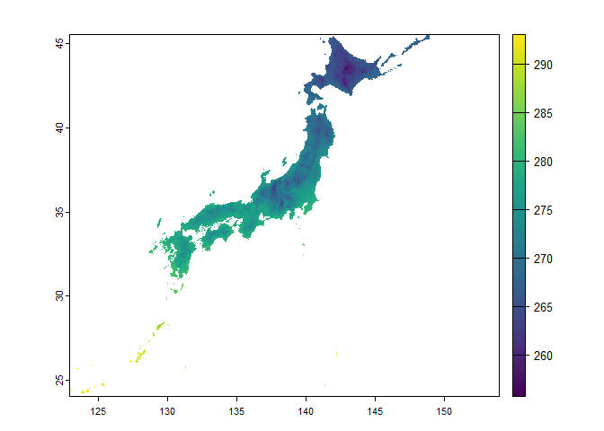
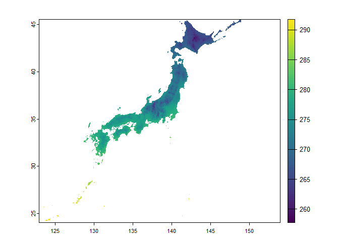

Get ERA5 data using API (package KrigR)
================

``` r
# install non-CRAN packages
# devtools::install_github("https://github.com/ErikKusch/KrigR")
# remotes::install_github("wmgeolab/rgeoboundaries")
```

``` r
pacman::p_load(
    rio,            # import and export files
    here,           # locate files 
    tidyverse,      # data management and visualization
    KrigR,          # download ERA5 data
    rgeoboundaries, # get country political administrative boundaries
    terra,          # spatial data analysis + visualization
    gganimate,      # create map animation
    keyring,        # manage credentials
    tictoc          # processing time of code
)
```

## Get country borders

``` r
# get country borders #-----------
```

Get Country ISO3 Codes at
[WorldBank](https://wits.worldbank.org/wits/wits/witshelp/content/codes/country_codes.htm)

``` r
# Japan
country_sf <- rgeoboundaries::gb_adm0(country = "JPN")

country_sf
```

    ## Simple feature collection with 1 feature and 6 fields
    ## Geometry type: MULTIPOLYGON
    ## Dimension:     XY
    ## Bounding box:  xmin: 122.9339 ymin: 24.04562 xmax: 153.9867 ymax: 45.55724
    ## Geodetic CRS:  WGS 84
    ##   shapeGroup shapeType shapeName shapeISO                 shapeID shapeCanonical
    ## 1        JPN      ADM0     Japan      JPN 22093344B50624940221487          Japan
    ##                         geometry
    ## 1 MULTIPOLYGON (((123.766 24....

## Setup CDS API

``` r
# setup CDS API #------------------
# API_User <- "email@address.com"
# API_Key <- "api_key from ecmwfr"

# set the keyring to access CDS, enter API_Key in pop-up window
# keyring::key_set(service = "ECMWFR",
#                  username = API_User)
```

## Get started

``` r
# get started #----------------------
# available datasets
KrigR::Meta.List()
```

    ## [1] "reanalysis-era5-land-monthly-means" "reanalysis-era5-land"              
    ## [3] "reanalysis-era5-single-levels"

``` r
# available variables
(df_vars <- KrigR::Meta.Variables("reanalysis-era5-land-monthly-means") %>% 
        tibble())
```

    ## # A tibble: 59 × 5
    ##    Variable                                          CDSname Description Unit  Cumulative
    ##    <chr>                                             <chr>   <chr>       <chr> <lgl>     
    ##  1 2m temperature                                    2m_tem… Temperatur… K     FALSE     
    ##  2 Total precipitation                               total_… Accumulate… m     TRUE      
    ##  3 10m u-component of wind                           10m_u_… Eastward c… m s-1 FALSE     
    ##  4 10m v-component of wind                           10m_v_… Northward … m s-1 FALSE     
    ##  5 2m dewpoint temperature                           2m_dew… Temperatur… K     FALSE     
    ##  6 Evaporation from bare soil                        evapor… The amount… m of… TRUE      
    ##  7 Evaporation from open water surfaces excluding o… evapor… Amount of … m of… TRUE      
    ##  8 Evaporation from the top of canopy                evapor… The amount… m of… TRUE      
    ##  9 Evaporation from vegetation transpiration         evapor… Amount of … m of… TRUE      
    ## 10 Forecast albedo                                   foreca… Is a measu… dime… FALSE     
    ## # ℹ 49 more rows

``` r
# pop-up window
# fix(df_vars)

# fact sheet overview of dataset
KrigR::Meta.QuickFacts("reanalysis-era5-land-monthly-means")
```

    ## $DataSet
    ## [1] "reanalysis-era5-land-monthly-means"
    ## 
    ## $Type
    ## [1] "monthly_averaged_reanalysis"               
    ## [2] "monthly_averaged_reanalysis_by_hour_of_day"
    ## 
    ## $URL
    ## [1] "https://cds.climate.copernicus.eu/cdsapp#!/dataset/reanalysis-era5-land-monthly-means?tab=overview"
    ## 
    ## $Description
    ## [1] "ERA5-Land is a reanalysis dataset providing a consistent view of the evolution of land variables over several decades at an enhanced resolution compared to ERA5. ERA5-Land has been produced by replaying the land component of the ECMWF ERA5 climate reanalysis. Reanalysis combines model data with observations from across the world into a globally complete and consistent dataset using the laws of physics. Reanalysis produces data that goes several decades back in time, providing an accurate description of the climate of the past.\n\nERA5-Land provides a consistent view of the water and energy cycles at surface level during several decades. It contains a detailed record from 1950 onwards, with a temporal resolution of 1 hour. The native spatial resolution of the ERA5-Land reanalysis dataset is 9km on a reduced Gaussian grid (TCo1279). The data in the CDS has been regridded to a regular lat-lon grid of 0.1x0.1 degrees.\n\nThe data presented here is a post-processed subset of the full ERA5-Land dataset. Monthly-mean averages have been pre-calculated to facilitate many applications requiring easy and fast access to the data, when sub-monthly fields are not required."
    ## 
    ## $TResolution
    ## [1] "month"
    ## 
    ## $TStep
    ## [1] 1
    ## 
    ## $TStart
    ## [1] "1950-01-01 01:00:00 UTC"
    ## 
    ## $TEnd
    ## [1] "Present; Lag = 3 month"
    ## 
    ## $Projection
    ## [1] "WGS84 (EPSG: 4326)"
    ## 
    ## $SpatialResolution
    ## [1] 0.1
    ## 
    ## $CDSArguments
    ## $CDSArguments$area
    ## [1] -180  180  -90   90
    ## 
    ## $CDSArguments$format
    ## [1] "grib"       "netcdf.zip" "netcdf"

## Query temperature data

``` r
# query temp data #--------------

# get 48 layers, monthly average of 12 months x 4 years
folder_path <- here("era5_land/KrigR_japan")

start_date <- "2016-01-01 00:00"
end_date <- "2019-12-31 23:00"

# temp_raw <- KrigR::CDownloadS(
#     # get Type from results of KrigR::Meta.QuickFacts()
#     Type = "monthly_averaged_reanalysis",
#     Variable = "2m_temperature",
#     DataSet = "reanalysis-era5-land-monthly-means",
#     DateStart = start_date,
#     DateStop = end_date,
#     TZone = "Japan",
#     FUN = "mean",
#     TResolution = "month",
#     TStep = 1,
#     Dir = folder_path,
#     FileName = "KrigR_jp_temp_raw",
#     # coordinates
#     Extent = as(country_sf, "Spatial"),
#     API_User = API_User,
#     API_Key = keyring::key_get(service = "ECMWFR",
#                                username = API_User)
# )

temp_raw <- terra::rast(paste0(folder_path, "/KrigR_jp_temp_raw.nc"))
temp_raw
```

    ## class       : SpatRaster 
    ## dimensions  : 216, 311, 48  (nrow, ncol, nlyr)
    ## resolution  : 0.1, 0.1  (x, y)
    ## extent      : 122.884, 153.984, 23.996, 45.596  (xmin, xmax, ymin, ymax)
    ## coord. ref. : lon/lat Coordinate System imported from GRIB file 
    ## source      : KrigR_jp_temp_raw.nc 
    ## names       : KrigR~raw_1, KrigR~raw_2, KrigR~raw_3, KrigR~raw_4, KrigR~raw_5, KrigR~raw_6, ... 
    ## time        : 2016-01-01 01:00:00 to 2019-12-01 01:00:00 UTC

``` r
# plot layer 2 (Feb 2016)
terra::plot(temp_raw[[2]])
```

<!-- -->

## Model

``` r
# model #--------------------------
# covariates_ls <- KrigR::CovariateSetup(
#     # training dataset
#     Training = temp_raw,
#     # target resolution
#     Target = 0.01,
#     Extent = as(country_sf, "Spatial"),
#     Dir = folder_path
# )
# 
# KrigR::Plot.Covariates(covariates_ls)
```

## Kriging \#————–

``` r
# kriging #--------------------
# temp_krigged <- KrigR::Kriging(
#     Data = temp_raw,
#     Covariates_training = covariates_ls$Training,
#     Covariates_target = covariates_ls$Target,
#     Equation = "GMTED2010",
#     # number of points used for interpolation
#     nmax = 25,
#     Cores = 12,
#     FileName = "KrigR_jp_temp_krigged",
#     FileExtension = ".nc",
#     Dir = folder_path,
#     Compression = 9,
#     Keep_Temporary = FALSE,
#     verbose = TRUE
# )

temp_krigged <- terra::rast(paste0(folder_path, "/KrigR_jp_temp_krigged_Kriged.nc"))

# KrigR::Plot.Kriged(Krigs = temp_krigged)

# KrigR::Plot.Kriged(Krigs = temp_krigged[[2]])

terra::plot(temp_krigged[[1]])
```

<!-- -->

``` r
terra::plot(temp_krigged[[2]])
```

<!-- -->

## Visualize temperature map for every July

``` r
# visualize #-------------------
```

### Get temperature data for July

``` r
## temperature data #---------------------
(months_vector <- seq(from = as.Date(start_date),
                     to = as.Date(end_date),
                     by = "month"))
```

    ##  [1] "2016-01-01" "2016-02-01" "2016-03-01" "2016-04-01" "2016-05-01" "2016-06-01"
    ##  [7] "2016-07-01" "2016-08-01" "2016-09-01" "2016-10-01" "2016-11-01" "2016-12-01"
    ## [13] "2017-01-01" "2017-02-01" "2017-03-01" "2017-04-01" "2017-05-01" "2017-06-01"
    ## [19] "2017-07-01" "2017-08-01" "2017-09-01" "2017-10-01" "2017-11-01" "2017-12-01"
    ## [25] "2018-01-01" "2018-02-01" "2018-03-01" "2018-04-01" "2018-05-01" "2018-06-01"
    ## [31] "2018-07-01" "2018-08-01" "2018-09-01" "2018-10-01" "2018-11-01" "2018-12-01"
    ## [37] "2019-01-01" "2019-02-01" "2019-03-01" "2019-04-01" "2019-05-01" "2019-06-01"
    ## [43] "2019-07-01" "2019-08-01" "2019-09-01" "2019-10-01" "2019-11-01" "2019-12-01"

``` r
names(temp_krigged) <- months_vector
temp_krigged
```

    ## class       : SpatRaster 
    ## dimensions  : 2582, 3726, 48  (nrow, ncol, nlyr)
    ## resolution  : 0.008333333, 0.008333333  (x, y)
    ## extent      : 122.9332, 153.9832, 24.04153, 45.55819  (xmin, xmax, ymin, ymax)
    ## coord. ref. : lon/lat Coordinate System imported from GRIB file 
    ## source      : KrigR_jp_temp_krigged_Kriged.nc 
    ## names       : 2016-01-01, 2016-02-01, 2016-03-01, 2016-04-01, 2016-05-01, 2016-06-01, ... 
    ## time        : 2016-01-01 01:00:00 to 2019-12-01 01:00:00 UTC

``` r
(july_temp <- terra::subset(temp_krigged,
                           str_detect(names(temp_krigged), "07")))
```

    ## class       : SpatRaster 
    ## dimensions  : 2582, 3726, 4  (nrow, ncol, nlyr)
    ## resolution  : 0.008333333, 0.008333333  (x, y)
    ## extent      : 122.9332, 153.9832, 24.04153, 45.55819  (xmin, xmax, ymin, ymax)
    ## coord. ref. : lon/lat Coordinate System imported from GRIB file 
    ## source      : KrigR_jp_temp_krigged_Kriged.nc 
    ## names       : 2016-07-01, 2017-07-01, 2018-07-01, 2019-07-01 
    ## time        : 2016-07-01 01:00:00 to 2019-07-01 01:00:00 UTC

``` r
names(july_temp) <- str_split_i(months_vector, "-", 1) %>% unique()
july_temp
```

    ## class       : SpatRaster 
    ## dimensions  : 2582, 3726, 4  (nrow, ncol, nlyr)
    ## resolution  : 0.008333333, 0.008333333  (x, y)
    ## extent      : 122.9332, 153.9832, 24.04153, 45.55819  (xmin, xmax, ymin, ymax)
    ## coord. ref. : lon/lat Coordinate System imported from GRIB file 
    ## source      : KrigR_jp_temp_krigged_Kriged.nc 
    ## names       : 2016, 2017, 2018, 2019 
    ## time        : 2016-07-01 01:00:00 to 2019-07-01 01:00:00 UTC

``` r
# raster to dataframe
(july_temp_df <- as.data.frame(july_temp,
                              xy = TRUE,
                              na.rm = TRUE) %>% 
    tibble())
```

    ## # A tibble: 577,043 × 6
    ##        x     y `2016` `2017` `2018` `2019`
    ##    <dbl> <dbl>  <dbl>  <dbl>  <dbl>  <dbl>
    ##  1  149.  45.6   284.   284.   282.   284.
    ##  2  149.  45.6   284.   284.   282.   284.
    ##  3  149.  45.6   284.   284.   282.   284.
    ##  4  149.  45.6   284.   284.   282.   284.
    ##  5  149.  45.6   284.   284.   282.   284.
    ##  6  149.  45.6   284.   284.   282.   284.
    ##  7  149.  45.6   284.   284.   282.   284.
    ##  8  149.  45.6   284.   284.   282.   284.
    ##  9  149.  45.6   284.   284.   282.   284.
    ## 10  149.  45.6   284.   284.   282.   284.
    ## # ℹ 577,033 more rows

``` r
(july_temp_long <- tibble(july_temp_df) %>% 
    pivot_longer(cols = c(-x, -y),
                 names_to = "year",
                 values_to = "tempK") %>% 
    mutate(year = as.integer(year),
           tempC = weathermetrics::kelvin.to.celsius(tempK)))
```

    ## # A tibble: 2,308,172 × 5
    ##        x     y  year tempK tempC
    ##    <dbl> <dbl> <int> <dbl> <dbl>
    ##  1  149.  45.6  2016  284. 10.7 
    ##  2  149.  45.6  2017  284. 10.8 
    ##  3  149.  45.6  2018  282.  8.88
    ##  4  149.  45.6  2019  284. 10.9 
    ##  5  149.  45.6  2016  284. 10.7 
    ##  6  149.  45.6  2017  284. 10.8 
    ##  7  149.  45.6  2018  282.  8.85
    ##  8  149.  45.6  2019  284. 10.8 
    ##  9  149.  45.6  2016  284. 10.6 
    ## 10  149.  45.6  2017  284. 10.7 
    ## # ℹ 2,308,162 more rows

``` r
## animated map #----------------
# breaks
(vmin <- min(july_temp_long$tempC))
```

    ## [1] 8.38

``` r
(vmax <- max(july_temp_long$tempC))
```

    ## [1] 29.6

``` r
(breaks <- classInt::classIntervals(july_temp_long$tempC,
                                   n = 14,
                                   style = "equal")$brks)
```

    ##  [1]  8.380000  9.895714 11.411429 12.927143 14.442857 15.958571 17.474286 18.990000
    ##  [9] 20.505714 22.021429 23.537143 25.052857 26.568571 28.084286 29.600000

``` r
(cols <- hcl.colors(n = length(breaks),
                   palette = "Spectral",
                   rev = TRUE))
```

    ##  [1] "#584B9F" "#2275AF" "#0099B5" "#00B6B5" "#52CFB0" "#96E4AD" "#D0F4B1" "#FEFDBE"
    ##  [9] "#FDE896" "#FBCC6B" "#F6AD3E" "#EF8913" "#E5610A" "#C84040" "#A71B4B"

``` r
july_map <- ggplot() +
    geom_raster(data = july_temp_long,
                aes(x = x,
                    y = y,
                    fill = tempC)) +
    scale_fill_gradientn(name = "Celsius Degree",
                         colors = cols,
                         limits = c(vmin, vmax),
                         breaks = breaks,
                         labels = round(breaks, 0)) +
    guides(fill = guide_colorbar(direction = "horizontal",
                                 barheight = unit(1, units = "cm"),
                                 barwidth = unit(30, units = "cm"),
                                 title.position = "top",
                                 label.position = "bottom",
                                 title.hjust = .5,
                                 label.hjust = .5,
                                 nrow = 1,
                                 byrow = TRUE)) +
    labs(title = "Average July temperature (2016 - 2019)",
         subtitle = "{round(as.integer(frame_time))}") +
    theme_void() +
    theme(legend.position = "bottom",
          legend.title = element_text(size = 30,
                                      color = "grey10"),
          legend.text = element_text(size = 30,
                                     color = "grey10"),
          plot.title = element_text(size = 50,
                                    color = "grey10",
                                    hjust = .5,
                                    vjust = -1),
          plot.subtitle = element_text(size = 40,
                                       color = "grey10",
                                       hjust = .5,
                                       vjust = -1),
          plot.margin = unit(c(t = 0, r = 0, l = 0, b = 0),
                             "lines"))

timelapse_july_map <- july_map +
    gganimate::transition_time(year) +
    gganimate::ease_aes("linear",
                        interval = .1)

# animated_july_map <- gganimate::animate(timelapse_july_map,
#                                         nframes = 100,
#                                         duration = 10,
#                                         start_pause = 3,
#                                         end_pause = 30,
#                                         height = 1200,
#                                         width = 1200,
#                                         units = "px",
#                                         renderer = gifski_renderer(loop = TRUE))

# gganimate::anim_save(here("era5_land/KrigR_japan_july_temp.gif"),
#                      animated_july_map)
```
