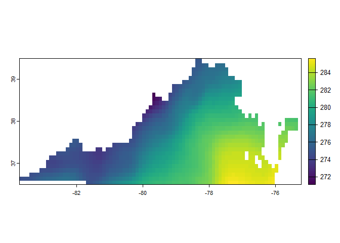

Get ERA5-Land hourly data using KrigR
================

``` r
pacman::p_load(
    rio,            # import and export files
    here,           # locate files 
    tidyverse,      # data management and visualization
    KrigR,          # download ERA5 data
    rgeoboundaries, # get country political administrative boundaries
    terra,          # spatial data analysis + visualization
    gganimate,      # create map animation
    keyring         # manage credentials
)
```

## Get Virginia and Richmond MSA borders

``` r
# get borders #-----------

# US states
(us_state_sf <- gb_adm1("United States"))
```

    ## Simple feature collection with 56 features and 6 fields
    ## Geometry type: MULTIPOLYGON
    ## Dimension:     XY
    ## Bounding box:  xmin: -179.1489 ymin: -14.54869 xmax: 179.7785 ymax: 71.36516
    ## Geodetic CRS:  WGS 84
    ## First 10 features:
    ##    shapeGroup shapeType      shapeName shapeISO                 shapeID shapeCanonical                       geometry
    ## 1         USA      ADM1    Mississippi    US-MS 66186276B69138566591314         States MULTIPOLYGON (((-88.50297 3...
    ## 2         USA      ADM1 North Carolina    US-NC  66186276B6801956407400         States MULTIPOLYGON (((-75.72681 3...
    ## 3         USA      ADM1       Oklahoma    US-OK 66186276B83300161667341         States MULTIPOLYGON (((-103.0022 3...
    ## 4         USA      ADM1       Virginia    US-VA 66186276B53580985925186         States MULTIPOLYGON (((-75.74241 3...
    ## 5         USA      ADM1  West Virginia    US-WV 66186276B64762166704956         States MULTIPOLYGON (((-77.71952 3...
    ## 6         USA      ADM1      Louisiana    US-LA 66186276B41335105066757         States MULTIPOLYGON (((-88.86771 2...
    ## 7         USA      ADM1       Michigan    US-MI 66186276B37442548568489         States MULTIPOLYGON (((-83.1916 42...
    ## 8         USA      ADM1  Massachusetts    US-MA 66186276B15934532614691         States MULTIPOLYGON (((-70.23405 4...
    ## 9         USA      ADM1          Idaho    US-ID 66186276B48953429733047         States MULTIPOLYGON (((-116.916 45...
    ## 10        USA      ADM1        Florida    US-FL 66186276B65591139260314         States MULTIPOLYGON (((-80.17628 2...

``` r
# Virginia
(va_sf <- us_state_sf %>% filter(shapeName == "Virginia"))
```

    ## Simple feature collection with 1 feature and 6 fields
    ## Geometry type: MULTIPOLYGON
    ## Dimension:     XY
    ## Bounding box:  xmin: -83.6754 ymin: 36.54075 xmax: -75.24227 ymax: 39.46602
    ## Geodetic CRS:  WGS 84
    ##   shapeGroup shapeType shapeName shapeISO                 shapeID shapeCanonical                       geometry
    ## 1        USA      ADM1  Virginia    US-VA 66186276B53580985925186         States MULTIPOLYGON (((-75.74241 3...

``` r
# US counties
(us_counties_sf <- gb_adm2("United States") %>% tibble())
```

    ## # A tibble: 3,233 × 7
    ##    shapeGroup shapeType shapeName  shapeISO shapeID                 shapeCanonical                                     geometry
    ##    <chr>      <chr>     <chr>      <chr>    <chr>                   <chr>                                    <MULTIPOLYGON [°]>
    ##  1 USA        ADM2      Highland   <NA>     52423323B51867153498623 Counties       (((-83.86568 39.24734, -83.83441 39.24572, …
    ##  2 USA        ADM2      Alpine     <NA>     52423323B67588574079428 Counties       (((-120.0725 38.50987, -120.0724 38.70277, …
    ##  3 USA        ADM2      Escambia   <NA>     52423323B97123089850170 Counties       (((-87.59883 30.99743, -87.5713 30.99784, -…
    ##  4 USA        ADM2      Lawrence   <NA>     52423323B54167037237770 Counties       (((-87.90812 38.85011, -87.7596 38.84952, -…
    ##  5 USA        ADM2      Wayne      <NA>     52423323B18579387327768 Counties       (((-88.94336 31.82457, -88.91046 31.82665, …
    ##  6 USA        ADM2      Tishomingo <NA>     52423323B71362276548625 Counties       (((-88.36354 34.9956, -88.25812 34.99547, -…
    ##  7 USA        ADM2      Sanders    <NA>     52423323B19966710463863 Counties       (((-116.0497 48.21612, -116.0167 48.20622, …
    ##  8 USA        ADM2      Albany     <NA>     52423323B67077901806593 Counties       (((-74.18028 42.72999, -74.1065 42.73924, -…
    ##  9 USA        ADM2      Potter     <NA>     52423323B68632918387185 Counties       (((-78.20661 41.99963, -78.12473 42.00046, …
    ## 10 USA        ADM2      Greene     <NA>     52423323B68605261841500 Counties       (((-93.62116 37.42743, -93.43724 37.42356, …
    ## # ℹ 3,223 more rows

## Get ERA5 data

``` r
# get era5 data #-----------------
folder_path <- here("era5_land/")

# start_date <- "2016-01-01 00:00"
# end_date <- "2016-01-04 23:00"

# temp_raw <- KrigR::CDownloadS(
#     Variable = "2m_temperature",
#     DataSet = "reanalysis-era5-land",
#     DateStart = start_date,
#     DateStop = end_date,
#     TZone = "US/Eastern",
#     FUN = "mean",
#     TResolution = "hour",
#     TStep = 1,
#     Dir = folder_path,
#     FileName = "KrigR_temp_raw",
#     Extent = as(va_sf, "Spatial"), # coordinates
#     API_User = API_User, # email address
#     API_Key = keyring::key_get(service = "ECMWFR",
#                                username = API_User)
# )

temp_raw <- rast(paste0(folder_path, "/KrigR_temp_raw.nc"))
temp_raw
```

    ## class       : SpatRaster 
    ## dimensions  : 30, 85, 96  (nrow, ncol, nlyr)
    ## resolution  : 0.1, 0.1  (x, y)
    ## extent      : -83.725, -75.225, 36.491, 39.491  (xmin, xmax, ymin, ymax)
    ## coord. ref. : lon/lat Coordinate System imported from GRIB file 
    ## source      : KrigR_temp_raw.nc 
    ## names       : KrigR~raw_1, KrigR~raw_2, KrigR~raw_3, KrigR~raw_4, KrigR~raw_5, KrigR~raw_6, ... 
    ## time        : 2016-01-01 05:00:00 to 2016-01-05 04:00:00 UTC

``` r
terra::plot(temp_raw[[2]])
```

<!-- -->

## Kriging

``` r
# kriging #--------------------
# covariates_ls <- KrigR::CovariateSetup(
#     # training dataset
#     Training = temp_raw,
#     # target resolution
#     Target = 0.01,
#     Extent = as(va_sf, "Spatial"),
#     Dir = folder_path
# )
# 
# temp_krigged <- KrigR::Kriging(
#     Data = temp_raw,
#     Covariates_training = covariates_ls$Training,
#     Covariates_target = covariates_ls$Target,
#     Equation = "GMTED2010",
#     # number of points used for interpolation
#     nmax = 25,
#     Cores = 12,
#     FileName = "KrigR_va_temp",
#     FileExtension = ".nc",
#     Dir = folder_path,
#     Compression = 9,
#     Keep_Temporary = FALSE,
#     verbose = TRUE
# )

temp_krigged <- terra::rast(paste0(folder_path, "/KrigR_va_temp_Kriged.nc"))
temp_krigged
```

    ## class       : SpatRaster 
    ## dimensions  : 351, 1012, 96  (nrow, ncol, nlyr)
    ## resolution  : 0.008333333, 0.008333333  (x, y)
    ## extent      : -83.67514, -75.24181, 36.54153, 39.46653  (xmin, xmax, ymin, ymax)
    ## coord. ref. : lon/lat Coordinate System imported from GRIB file 
    ## source      : KrigR_va_temp_Kriged.nc 
    ## names       : KrigR~ged_1, KrigR~ged_2, KrigR~ged_3, KrigR~ged_4, KrigR~ged_5, KrigR~ged_6, ... 
    ## time        : 2016-01-01 05:00:00 to 2016-01-05 04:00:00 UTC

## Reshape raster to dataframe

``` r
# reshape raster to dataframe #------------------------
df_va <- as.data.frame(temp_krigged,
                        xy = TRUE,
                        time = TRUE,
                        na.rm = TRUE)

tibble(df_va)
```

    ## # A tibble: 156,048 × 98
    ##        x     y `2016-01-01 05:00:00` `2016-01-01 06:00:00` `2016-01-01 07:00:00` `2016-01-01 08:00:00` `2016-01-01 09:00:00`
    ##    <dbl> <dbl>                 <dbl>                 <dbl>                 <dbl>                 <dbl>                 <dbl>
    ##  1 -78.3  39.5                  275.                  274.                  274.                  274.                  274.
    ##  2 -78.3  39.5                  275.                  274.                  275.                  275.                  274.
    ##  3 -78.3  39.5                  274.                  274.                  274.                  274.                  274.
    ##  4 -78.3  39.5                  275.                  274.                  275.                  274.                  274.
    ##  5 -78.3  39.5                  275.                  275.                  275.                  275.                  275.
    ##  6 -78.3  39.5                  276.                  275.                  275.                  275.                  275.
    ##  7 -78.3  39.4                  274.                  274.                  274.                  274.                  274.
    ##  8 -78.3  39.4                  275.                  274.                  275.                  274.                  274.
    ##  9 -78.3  39.4                  275.                  275.                  275.                  275.                  275.
    ## 10 -78.3  39.4                  276.                  275.                  275.                  275.                  275.
    ## # ℹ 156,038 more rows
    ## # ℹ 91 more variables: `2016-01-01 10:00:00` <dbl>, `2016-01-01 11:00:00` <dbl>, `2016-01-01 12:00:00` <dbl>,
    ## #   `2016-01-01 13:00:00` <dbl>, `2016-01-01 14:00:00` <dbl>, `2016-01-01 15:00:00` <dbl>, `2016-01-01 16:00:00` <dbl>,
    ## #   `2016-01-01 17:00:00` <dbl>, `2016-01-01 18:00:00` <dbl>, `2016-01-01 19:00:00` <dbl>, `2016-01-01 20:00:00` <dbl>,
    ## #   `2016-01-01 21:00:00` <dbl>, `2016-01-01 22:00:00` <dbl>, `2016-01-01 23:00:00` <dbl>, `2016-01-02` <dbl>,
    ## #   `2016-01-02 01:00:00` <dbl>, `2016-01-02 02:00:00` <dbl>, `2016-01-02 03:00:00` <dbl>, `2016-01-02 04:00:00` <dbl>,
    ## #   `2016-01-02 05:00:00` <dbl>, `2016-01-02 06:00:00` <dbl>, `2016-01-02 07:00:00` <dbl>, `2016-01-02 08:00:00` <dbl>, …

``` r
(va_temp_krigged <- df_va %>%
  pivot_longer(cols = c(-x, -y),
               names_to = "timestamp",
               values_to = "tempK") %>% 
  mutate(tempC = weathermetrics::kelvin.to.celsius(tempK),
         timeET = ymd_hms(timestamp, tz = "UTC") %>% 
           with_tz(., "US/Eastern"),
         date = date(timeET)))
```

    ## Warning: There was 1 warning in `mutate()`.
    ## ℹ In argument: `timeET = ymd_hms(timestamp, tz = "UTC") %>% with_tz(., "US/Eastern")`.
    ## Caused by warning:
    ## !  624192 failed to parse.

    ## # A tibble: 14,980,608 × 7
    ##        x     y timestamp           tempK tempC timeET              date      
    ##    <dbl> <dbl> <chr>               <dbl> <dbl> <dttm>              <date>    
    ##  1 -78.3  39.5 2016-01-01 05:00:00  275.  1.43 2016-01-01 00:00:00 2016-01-01
    ##  2 -78.3  39.5 2016-01-01 06:00:00  274.  0.97 2016-01-01 01:00:00 2016-01-01
    ##  3 -78.3  39.5 2016-01-01 07:00:00  274.  1.21 2016-01-01 02:00:00 2016-01-01
    ##  4 -78.3  39.5 2016-01-01 08:00:00  274.  1.14 2016-01-01 03:00:00 2016-01-01
    ##  5 -78.3  39.5 2016-01-01 09:00:00  274.  0.94 2016-01-01 04:00:00 2016-01-01
    ##  6 -78.3  39.5 2016-01-01 10:00:00  274.  0.59 2016-01-01 05:00:00 2016-01-01
    ##  7 -78.3  39.5 2016-01-01 11:00:00  274.  0.36 2016-01-01 06:00:00 2016-01-01
    ##  8 -78.3  39.5 2016-01-01 12:00:00  273.  0.15 2016-01-01 07:00:00 2016-01-01
    ##  9 -78.3  39.5 2016-01-01 13:00:00  273. -0.03 2016-01-01 08:00:00 2016-01-01
    ## 10 -78.3  39.5 2016-01-01 14:00:00  273.  0.33 2016-01-01 09:00:00 2016-01-01
    ## # ℹ 14,980,598 more rows

## Animated map

``` r
## animated map #----------------
# breaks
# (breaks <- classInt::classIntervals(va_temp_krigged$tempC,
#                                     n = 14,
#                                     style = "equal")$brks)
# 
# (cols <- hcl.colors(n = length(breaks),
#                     palette = "Spectral",
#                     rev = TRUE))
# 
# va_map <- ggplot() +
#   geom_raster(data = va_temp_krigged,
#               aes(x = x,
#                   y = y,
#                   fill = tempC)) +
#   borders("county", regions = "virginia") +
#   scale_fill_gradientn(name = "Celsius Degree",
#                        colors = cols,
#                        limits = c(min(va_temp_krigged$tempC),
#                                   max(va_temp_krigged$tempC)),
#                        breaks = breaks,
#                        labels = round(breaks, 0)) +
#   guides(fill = guide_colorbar(direction = "horizontal",
#                                barheight = unit(1, units = "cm"),
#                                barwidth = unit(30, units = "cm"),
#                                title.position = "top",
#                                label.position = "bottom",
#                                title.hjust = .5,
#                                label.hjust = .5,
#                                nrow = 1,
#                                byrow = TRUE)) +
#   labs(title = "Hourly temperature in Virginia",
#        subtitle = "{frame_time}") +
#   theme_void() +
#   theme(legend.position = "bottom",
#         legend.title = element_text(size = 30,
#                                     color = "grey10"),
#         legend.text = element_text(size = 30,
#                                    color = "grey10"),
#         plot.title = element_text(size = 50,
#                                   color = "grey10",
#                                   hjust = .5,
#                                   vjust = -1),
#         plot.subtitle = element_text(size = 40,
#                                      color = "grey10",
#                                      hjust = .5,
#                                      vjust = -1),
#         plot.margin = unit(c(t = 0, r = 0, l = 0, b = 0),
#                            "lines"))
# 
# timelapse_va_map <- va_map +
#   gganimate::transition_time(date) +
#   gganimate::ease_aes("linear",
#                       interval = .1)
# 
# animated_va_map <- gganimate::animate(timelapse_va_map,
#                                         nframes = 100,
#                                         duration = 10,
#                                         start_pause = 3,
#                                         end_pause = 10,
#                                         height = 1200,
#                                         width = 2400,
#                                         units = "px",
#                                         renderer = gifski_renderer(loop = TRUE))
# 
# gganimate::anim_save(here("era5_land/KrigR_va_temp.gif"),
#                      animated_va_map)
```
