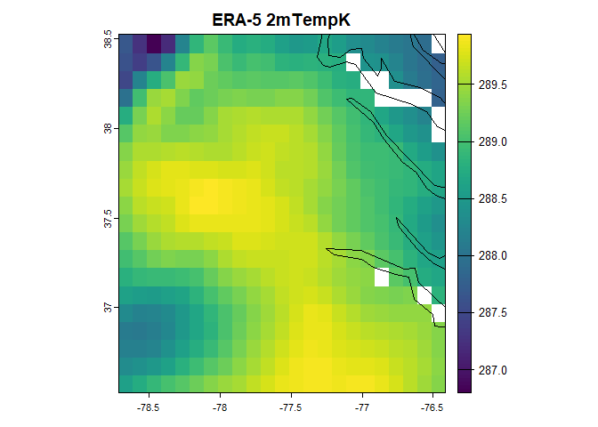
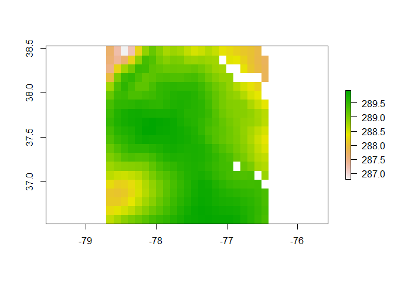
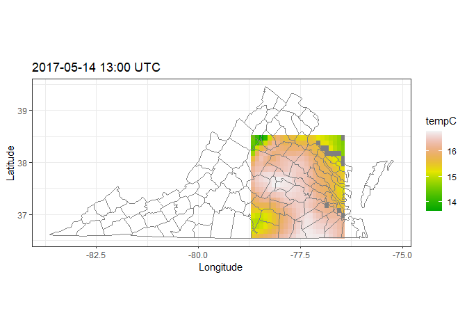

Get ERA5-Land data using API
================

``` r
pacman::p_load(
        rio,            # import and export files
        here,           # locate files 
        tidyverse,      # data management and visualization
        ecmwfr,         
        raster,
        terra,
        maps,
        chva.extras     # supplementary functions
)
```

## Download data

``` r
# data #-----------
```

### step1: set CDS API (once)

### step2: get request string

``` r
request <- list(
  dataset_short_name = "reanalysis-era5-land",
  variable = "2m_temperature",
  year = "2017",
  month = "05",
  day = c("14"),
  time = c("13:00"),
  data_format = "netcdf",
  download_format = "unarchived",
  area = c(38.5236, -78.665, 36.5757, -76.4348),
  target = "ecmwfr_20170514_1300.nc"
)
```

### step3: download data

``` r
ncfile <- wf_request(request = request, # the request
                     transfer = TRUE, # download the file
                     path = here("era5_land/"), # directory to save file
                     verbose = FALSE)
```

    ## Superclass ecmwfr_service has cloneable=FALSE, but subclass ecmwfr_ds has cloneable=TRUE. A subclass cannot be cloneable when its superclass is not cloneable, so cloning will be disabled for ecmwfr_ds.

## Check data

### `terra` Rpackage

``` r
# terra:: #----------------------
# Open NetCDF file and plot the data
ncfile <- here("era5_land/ecmwfr_20170514_1300.nc")

r <- terra::rast(ncfile)
r
```

    ## class       : SpatRaster 
    ## dimensions  : 20, 23, 1  (nrow, ncol, nlyr)
    ## resolution  : 0.1, 0.1000526  (x, y)
    ## extent      : -78.715, -76.415, 36.52497, 38.52603  (xmin, xmax, ymin, ymax)
    ## coord. ref. : lon/lat WGS 84 (CRS84) (OGC:CRS84) 
    ## source      : ecmwfr_20170514_1300.nc 
    ## varname     : t2m (2 metre temperature) 
    ## name        : t2m_valid_time=1494766800 
    ## unit        :                         K

``` r
terra::plot(r, main = "ERA-5 2mTempK")
maps::map("world", add = TRUE)
```

<!-- -->

### `raster` and `ggplot2`

``` r
# raster:: #-------------------------
dset <- raster(ncfile)
```

    ## Loading required namespace: ncdf4

``` r
dset
```

    ## class      : RasterLayer 
    ## dimensions : 20, 23, 460  (nrow, ncol, ncell)
    ## resolution : 0.1, 0.1000526  (x, y)
    ## extent     : -78.715, -76.415, 36.52497, 38.52603  (xmin, xmax, ymin, ymax)
    ## crs        : +proj=longlat +datum=WGS84 +no_defs 
    ## source     : ecmwfr_20170514_1300.nc 
    ## names      : X2.metre.temperature 
    ## z-value    : 1494766800 
    ## zvar       : t2m

``` r
plot(dset)
```

<!-- -->

``` r
# ggplot2:: #--------------------
df <- as.data.frame(dset, xy = TRUE) 
tibble(df)
```

    ## # A tibble: 460 × 3
    ##        x     y X2.metre.temperature
    ##    <dbl> <dbl>                <dbl>
    ##  1 -78.7  38.5                 288.
    ##  2 -78.6  38.5                 287.
    ##  3 -78.5  38.5                 287.
    ##  4 -78.4  38.5                 287.
    ##  5 -78.3  38.5                 288.
    ##  6 -78.2  38.5                 289.
    ##  7 -78.1  38.5                 289.
    ##  8 -78.0  38.5                 289.
    ##  9 -77.9  38.5                 289.
    ## 10 -77.8  38.5                 289.
    ## # ℹ 450 more rows

``` r
(df1 <- df %>% 
        tibble() %>% 
        mutate(tempC = weathermetrics::kelvin.to.celsius(X2.metre.temperature)))
```

    ## # A tibble: 460 × 4
    ##        x     y X2.metre.temperature tempC
    ##    <dbl> <dbl>                <dbl> <dbl>
    ##  1 -78.7  38.5                 288.  14.5
    ##  2 -78.6  38.5                 287.  14.1
    ##  3 -78.5  38.5                 287.  13.6
    ##  4 -78.4  38.5                 287.  14.0
    ##  5 -78.3  38.5                 288.  15.1
    ##  6 -78.2  38.5                 289.  15.7
    ##  7 -78.1  38.5                 289.  16.0
    ##  8 -78.0  38.5                 289.  15.8
    ##  9 -77.9  38.5                 289.  15.6
    ## 10 -77.8  38.5                 289.  15.6
    ## # ℹ 450 more rows

``` r
df1 %>% 
        ggplot() +
        geom_raster(aes(x = x, y = y, fill = tempC)) +
        scale_fill_gradientn(colors = terrain.colors(100, rev = FALSE)) +
        borders("county", regions = "virginia") +
        coord_quickmap() +
        labs(x = "Longitude",
             y = "Latitude",
             title = "2017-05-14 13:00 UTC") +
        theme_bw()
```

<!-- -->
